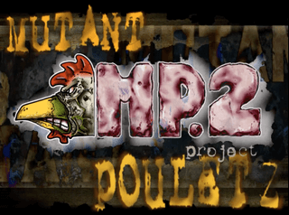
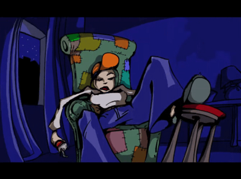
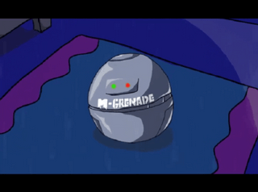
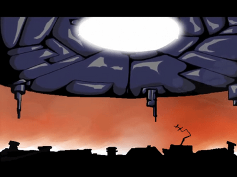

# The Mutant Pouletz Project 2 - The Dioxin Menace

   

Presented at Orange Juice's LTP4 démo-compo (August 25-26-27, 2000, France).

:warning: Check the [LTP4](https://github.com/Mutantinc/MP2---The-Dioxin-Menace/tree/LTP4) and the [OpenGL-Remix](https://github.com/Mutantinc/MP2---The-Dioxin-Menace/tree/OpenGL-Remix) branches for the different versions.

## Credits

- Graphs: Danube, Splif, Acetone, Fra, AlexKidd
- Music: Rez
- Code: Mars

## Release Notes

- **Requirements:** Windows 9x/2K OS with 64+Mb of memory and Direct-X v7+
- **ATI Graphics Cards:** There may be blitting bugs on ATI graphic cards. These bugs occur when some sprites are hard-blitted. This is probably due to a direct-draw flaw (maybe a coder-flaw also).
- **Nvidia Graphics Cards:** The windowed mode may not work on Nvidia graphic cards.
- **Performance:** Sometimes you may experience slow-downs. This is because software alpha-channel routines are highly used (DD doesn't support hard-alpha).
- **Music Player:** The music player is fmod 3.20 / minifmod 1.20
- **Effects & Timings:** Here, you have the effects & timings frozen on 2000-08-20

## Background

This crazy project was first coded for LTP3 back in 1999 (as a sequel to the Mutant Poulets project showcased at Volcanic Party 5, also in 1999, France). However, it wasn't released because it just wasn't ready... like, not at all! So, we waited a whole year to show it off at another awesome French demo competition.

## Inspiration

Don't even expect us to explain the scenarii. This is the result of:

- A meeting of several demo freaks in a pub in London
- Self deliriums of 5 graphicians
- Influences from several movies
- ...

## Special Thanks

Special thanks go to Arthur, tuo & Lord.K for programming advices.

---

We hope you'll like it!

```
                                                            
                                                            
             ,%@@@@#*                   .@,   .,            
        &@@@@@@@@@@@@@@@@&              /(*@@@@@@#     .    
     *@@@@@@@@@@@@@@@@@@@@@@@@       *&@@@@@@@@@..&@.       
   @@@@@@@%@@@@@@@@@@@@@@@@@@@@@@@@@@@@@@@@@@@@ @@@ .@/     
 .@,   @@@@@,@@@,   #@@@@@%.             %@#@@@@/@@@@& @&   
                  @@@@@*                  @@&@@@@  @@@&@@@  
                .@@@@#                    /@@@&@@ @.*@@@@@@ 
                @@@@*           %@@@@@@,   (@@@@. %/* @@@@% 
               @@@@%         @%     @@@@@@@            @@@  
               @@@@       .@           @@@@@(         @@    
               @@@@       @/ @@@@,       &@@&               
               /@@@        #@@@@@         @@                
                @@@%                     @@.                
                 &@@@.                /@@@                  
                   @@@@@@@@@@@@&&@@@@@@@(                   
                     ,@@@@@@@@@@@@@@@@&                     
                             ***/,                          
                                                            
                                                            
```
